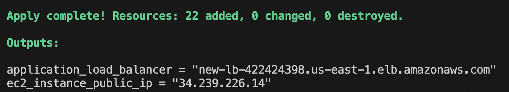

# Terraform Infrastructure Setup

This repository contains Terraform configurations and scripts to set up infrastructure and create certificates. Follow the instructions below to get started.


## Prerequisites

1. [Terraform](https://www.terraform.io/downloads.html) (version 1.0.0 or later)
2. [AWS CLI](https://docs.aws.amazon.com/cli/latest/userguide/getting-started-install.html)


## Setup

1. Clone this repository:
```bash
git clone <git-repo-url>
cd <git-repo-url>
```

2. Configure Aws on terminal:
```bash
aws configure
```
After this you have to give  AWS access key, secret key and AWS region.

2. Initialize Terraform:
```bash
terraform init
```
3. Generate a self-signed certificate:
note: give any domain name
```
openssl req -x509 -nodes -days 365 -newkey rsa:2048 -keyout private.key -out certificate.crt -subj "/CN=example.com"
```
## Directory details

To enhance the organization and maintainability of our Terraform configuration, we use a modular approach with a dedicated modules directory. This directory contains subfolders for instance, load_balancer, and network, each with its own main.tf, output.tf, and variables.tf files.

- **Instance Module**: Manages compute instance provisioning and configuration.
- **Load Balancer Module**: Handles load balancer setup and management.
- **Network Module**: Encapsulates networking infrastructure, including virtual networks and subnets.

At the root level, the main.tf file serves as the entry point, defining and referencing the various modules for infrastructure deployment. This modular approach improves organization, reusability, and maintainability of our Terraform code. Each module can be independently developed, tested, and versioned, promoting separation of concerns and easier team collaboration.


```bash

├── modules/
│   ├── instance/
│   │   ├── main.tf
│   │   ├── outputs.tf
│   │   └── variables.tf
│   ├── load_balancer/
│   │   ├── main.tf
│   │   ├── outputs.tf
│   │   └── variables.tf
│   └── network/
│       ├── main.tf
│       ├── outputs.tf
│       └── variables.tf
├── data.tf
├── main.tf
├── outputs.tf
```

## Running Terraform

1. Review the execution plan:
```bash
terraform plan
```
Enter your Ip address with subnet mask length(example: 173.170.142.167/32), enter your Availabily zone1 within aws region(example: us-east-1a) and enter your Availabily zone2 within aws region(example: us-east-1b) 

2. Apply the Terraform configuration:
```bash
terraform apply
```
Enter your Ip address with subnet mask length(example: 173.170.142.167/32), enter your Availabily zone1 within aws region(example: us-east-1a) and enter your Availabily zone2 within aws region(example: us-east-1b)

Type `yes` when prompted to confirm.

3. Steps to Verify Result:

After Every Infrastructure is Deployed successfully you will get the dns name and public ip address as output in terminal.
Copy and paste the dns name on browser,
after that you will get security warning so select "proceed to {your dns name} unsafe",Now you can see the output hello word {your host}.


4. Output

- **Terminal output:**


- **Browser output:**


5. Destroy the terraform configuration
```bash
terraform destroy
```
Again add ip address,availability zone1, zone2 and type yes.


